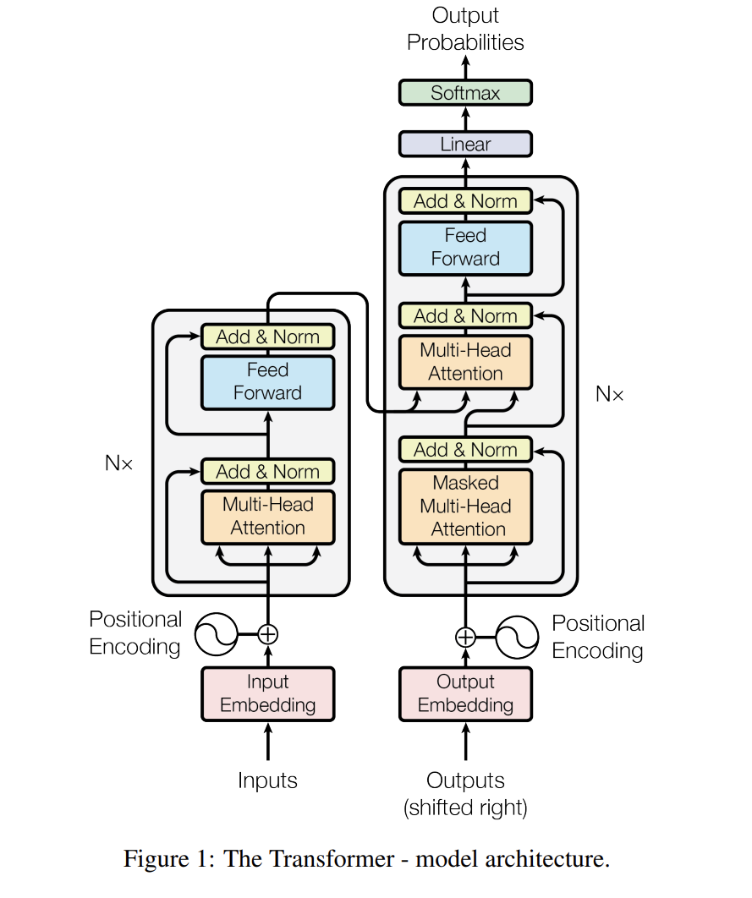

# **Attention Is All You Need**

Implementation of the Transformer model from the paper [Attention Is All You Need](https://arxiv.org/pdf/1706.03762.pdf) in Pytorch.

The dominant sequence transduction models are based on complex recurrent or
convolutional neural networks that include an encoder and a decoder. The best
performing models also connect the encoder and decoder through an attention
mechanism. This paper propose a new simple network architecture, the Transformer,
based solely on attention mechanisms, dispensing with recurrence and convolutions
entirely. Experiments on two machine translation tasks show these models to
be superior in quality while being more parallelizable and requiring significantly
less time to train. This model achieves 28.4 BLEU on the WMT 2014 English-to-German translation task, improving over the existing best results, including
ensembles, by over 2 BLEU. On the WMT 2014 English-to-French translation task,
this model establishes a new single-model state-of-the-art BLEU score of 41.8 after
training for 3.5 days on eight GPUs, a small fraction of the training costs of the
best models from the literature. This paper show that the Transformer generalizes well to
other tasks by applying it successfully to English constituency parsing both with
large and limited training data.

### **Todo**
- [x] implement the transformer model for machine translation.
- [x] implement the encoder and decoder.
- [x] implement the positional encoding.
- [x] implement the multi-head attention.
- [x] implement the feed forward network.
- [x] implement the training and evaluation code. 

### **Citations**
```bibtex
@misc{Vaswani2017,
    author = {Vaswani A., Shazeer N., Parmar N., Uszkoreit J., Jones L., Gomez A. N., Kaiser L., & Polosukhin I.},
    title = {Attention Is All You Need}, 
    year   = {2017},
    eprint = {arXiv:1706.03762},
}
```
